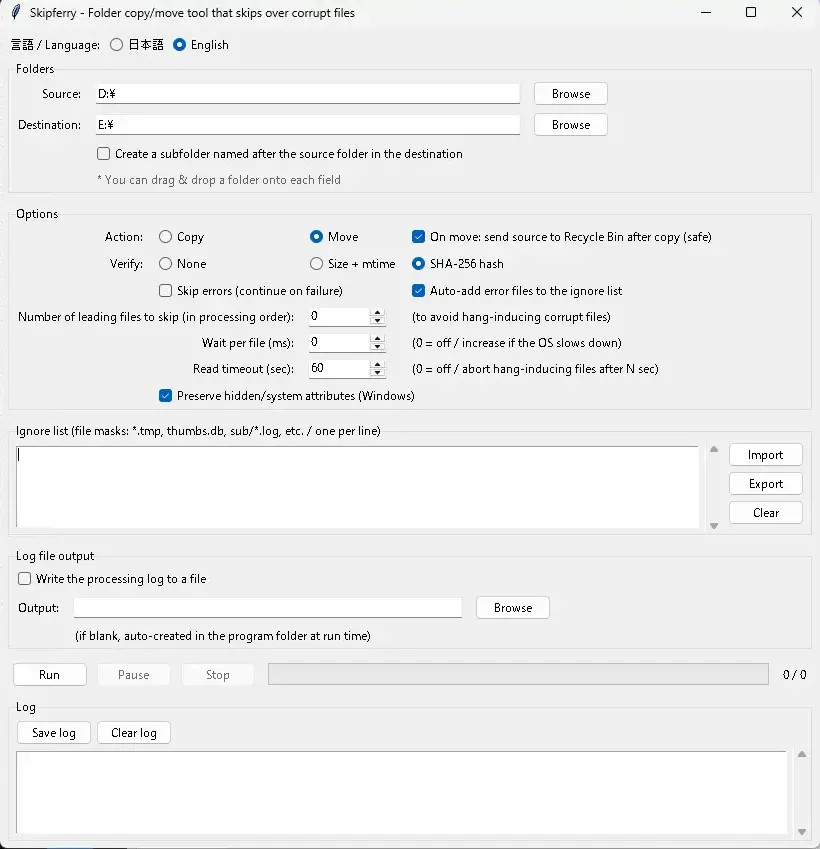

# Skipferry

**English** | [日本語](#日本語)

A Python/Tkinter GUI tool for copying and moving folders, built primarily to survive corrupt files — the kind that hang the application or even the OS when touched.

The name is a blend of skip (skip over corrupt files) + ferry (carry the healthy files across safely).



---

## Why Skipferry?

Some corrupt files hang the whole process the moment they are read, so an ordinary copy tool freezes and never finishes. Skipferry is designed to get the healthy files across anyway:

- **Skip the first N files** in processing order — when you know (or can narrow down) which file hangs, skip past it. Processing order is deterministic, so this is reproducible.
- **Read timeout** — run each copy in a separate child process and, if it does not return within N seconds, kill the process and move on. (Python cannot kill a thread, but it can kill a process — so a truly OS-hanging read can still be abandoned.)
- **Per-file logging that never buffers** — each file's start line is written before the copy and left open, so if something freezes, the last log line points straight at the culprit.

On top of that it offers recursive copy/move, timestamp preservation, verification, recycle-bin deletion, an ignore list, and more.

## Features

- **Copy or move** a folder to a destination (recursive, same-drive and cross-drive).
- **Skip first N files** in processing order (core corrupt-file workaround).
- **Read timeout** (seconds): abort files whose read hangs, via a killable child process. `0` = off.
- **On-error dialog** when error-skip is off: choose **Retry / Skip / Abort** per failing file.
- **File timestamp preservation** (`shutil.copy2`); folder timestamps re-applied after all files are processed.
- **Verification**: none / size + mtime / SHA-256 hash.
- **Move**: copy → verify → delete source (never `os.rename`), so cross-drive moves and verification both work. Deletion can go to the Recycle Bin.
- **Error skip**: keep going when a single file fails.
- **Auto-ignore on error**: add errored files to the ignore list, so a re-run skips them automatically.
- **Preserve hidden/system attributes** (Windows, optional): re-apply the source's hidden/system attributes to the copy (`shutil.copy2` does not carry them). Off by default.
- **Ignore list**: one file-mask per line (`fnmatch`); import/export as text.
- **Per-file wait** (ms) to ease OS/application load.
- **Pause / resume / stop**, all cooperative and responsive.
- **Log file output** (optional); default location is the program folder.
- **Language switch** for UI and log: Japanese / English.
- **Settings persistence**: saved to `skipferry.ini` next to the program.
- **Pre-run preview**: shows the first files to be processed and asks for confirmation.
- **Drag & drop** of source/destination folders (when `tkinterdnd2` is available).

## Requirements

- **Python 3** with Tkinter (standard library). No extra packages are required to run.
- Optional:
  - `Send2Trash` — nicer Recycle Bin support (`pip install Send2Trash`). Without it, Windows falls back to `SHFileOperation` via `ctypes`.
  - `tkinterdnd2` — drag & drop of folders (`pip install tkinterdnd2`). Without it, the app runs normally without D&D.
- **Windows** is the primary target (the Recycle-Bin fallback is Windows-only).

## Run

```
python skipferry.py
```

The app starts and works even without the optional packages above.

## Usage

1. Set the source and destination folders (type, browse, or drag & drop).
2. Choose options (copy/move, verify, error-skip, ignore list, etc.).
3. Press run — a preview shows the first files to be processed; confirm to start.
4. Watch progress and the log; use pause / resume / stop as needed.

### Options

| Option | Description |
| --- | --- |
| Action (copy / move) | Move is implemented as copy → verify → delete source. |
| To Recycle Bin (move) | On move, send the source to the Recycle Bin instead of deleting permanently. |
| Verify | none / size + mtime / SHA-256 hash. |
| Error skip | Continue when a single file fails. When off, a Retry / Skip / Abort dialog appears. |
| Auto-ignore on error | Add the failing file to the ignore list automatically. |
| Preserve hidden/system attributes | Re-apply the source's hidden/system attributes to the copy (Windows). Off by default. |
| Skip first N | Skip the first N files in processing order (corrupt-file workaround). |
| Wait per file (ms) | Insert a delay after each file to reduce load. `0` = off. |
| Read timeout (sec) | Abort files whose read hangs after N seconds, by killing the copy child process. `0` = off. |

### Ignore list

- One file-mask per line, matched with `fnmatch`.
- A pattern containing a separator (`/`, `\`) matches the whole relative path; otherwise it matches the file name only.
- Lines starting with `#` and blank lines are ignored. Text I/O is UTF-8 (import tolerates a BOM).

### Handling corrupt / hanging files

- **If you know which file hangs**: use Skip first N to jump past it (processing order is deterministic).
- **If you don't**: set a Read timeout so any file that stalls is killed and skipped after N seconds. Timed-out files are treated as errors, so with auto-ignore on they are recorded and skipped on the next run.
- The log writes each file's start line before copying and does not add a newline until the result is known, so a frozen run leaves the offending file as the last log line.

## Notes & limitations

- File attributes, ACLs, and alternate data streams (ADS) are not touched by default — system defaults apply (by design). The optional "Preserve hidden/system attributes" reapplies only the hidden/system flags on Windows; read-only is already preserved by `shutil.copy2`.
- On move, a source folder that still contains files (due to errors / ignore / skip-N) is not removed; only empty folders are cleaned up, deepest first.
- Copying into a destination that is inside or equal to the source is refused.
- On Windows, a process stuck in an uninterruptible kernel I/O wait may not release instantly on `terminate()`; the copy child is a daemon and does not block app exit.

## License

MIT License — see [LICENSE](LICENSE).

---

<a name="日本語"></a>

# Skipferry（日本語）

[English](#skipferry) | **日本語**

フォルダのコピー/移動を行う Python（Tkinter）製 GUI ツールです。破損ファイル対策を主目的としています — 触れるとアプリや OS ごと固まってしまうタイプの破損ファイルがあっても、健全なファイルを運び切ることを狙っています。

名称は skip（破損ファイルを飛ばす）＋ ferry（健全なファイルを渡し船で運ぶ）の造語です。

---

## なぜ Skipferry か

一部の破損ファイルは読み込んだ瞬間に処理全体を固まらせるため、通常のコピーツールでは途中で止まって最後まで終わりません。Skipferry はそれでも健全なファイルを運び切ることを目指します。

- **処理順で先頭 N 件をスキップ** — 固まる原因ファイルが分かる（または絞り込める）なら、その手前まで飛ばせます。処理順は決定論的なので再現できます。
- **リード タイムアウト** — 各コピーを別の子プロセスで実行し、指定秒以内に返らなければプロセスごと kill して次へ進みます。（Python はスレッドを kill できませんが、プロセスは kill できるため、OS ごと固まる読み取りも打ち切れます。）
- **バッファしない逐次ログ** — 各ファイルの開始行をコピー前に出して行を開いたままにするので、固まってもログ最終行が原因ファイルを指します。

これに加え、再帰コピー/移動、タイムスタンプ維持、ベリファイ、ごみ箱送り、無視リストなどを備えます。

## 主な機能

- **コピー/移動**: フォルダを移動先へ（サブフォルダ含む・同一/別ドライブ対応）。
- **先頭スキップ**: 処理順で先頭 N 件を飛ばす（破損ファイル対策の中核）。
- **リード タイムアウト（秒）**: 読み取りが固まるファイルを、kill 可能な子プロセスで打ち切り。`0` で無効。
- **エラー確認ダイアログ**: エラースキップ無効時、失敗ファイルごとに **再試行 / スキップ / 終了** を選択。
- **タイムスタンプ維持**（`shutil.copy2`）。フォルダのタイムスタンプは全ファイル処理後に再適用。
- **ベリファイ**: なし / サイズ+更新日時 / SHA-256 ハッシュ。
- **移動**: 「コピー→検証→元削除」で実装（`os.rename` は使わない）。別ドライブ移動と検証を両立。削除はごみ箱送りも選択可。
- **エラースキップ**: 1 件失敗しても続行。
- **エラー時自動無視登録**: 失敗ファイルを無視リストへ自動追加し、再実行時に自動でスキップ。
- **隠し/システム属性を維持**（Windows・任意）: コピー先へ元の隠し/システム属性を再適用（`shutil.copy2` はこれらを引き継がない）。既定はオフ。
- **無視リスト**: 1 行 1 件のファイルマスク（`fnmatch`）。テキストで入出力可。
- **ファイルごとのウェイト（ミリ秒）**: OS/アプリの負荷軽減。
- **一時停止 / 再開 / 停止**（すべて協調的で即応）。
- **ログファイル出力**（任意）。既定の出力先はプログラムと同じフォルダ。
- **言語切替**（UI・ログ）: 日本語 / English。
- **設定の永続化**: プログラムと同じ場所の `skipferry.ini` に保存。
- **実行前プレビュー**: 処理先ファイルの先頭を提示して確認。
- **ドラッグ&ドロップ**でコピー元/先を指定（`tkinterdnd2` があるとき）。

## 動作要件

- **Python 3** ＋ Tkinter（標準ライブラリ）。追加パッケージ無しで起動・動作します。
- 任意:
  - `Send2Trash` — ごみ箱送りをより確実に（`pip install Send2Trash`）。無い場合は Windows の `SHFileOperation`（`ctypes`）へ自動フォールバック。
  - `tkinterdnd2` — フォルダのドラッグ&ドロップ（`pip install tkinterdnd2`）。無い場合は D&D 無効で通常起動。
- **Windows** が主対象（ごみ箱送りフォールバックは Windows 専用）。

## 実行

```
python skipferry.py
```

上記の任意パッケージが無くても起動・動作します。

## 使い方

1. コピー元・コピー先フォルダを指定（入力・参照・ドラッグ&ドロップ）。
2. オプションを選択（コピー/移動、ベリファイ、エラースキップ、無視リスト等）。
3. 実行 → プレビューで処理先ファイルの先頭を確認し、開始。
4. 進捗とログを確認。必要に応じて一時停止 / 再開 / 停止。

### オプション

| オプション | 説明 |
| --- | --- |
| 動作（コピー / 移動） | 移動は「コピー→検証→元削除」で実装。 |
| ごみ箱へ（移動時） | 移動時、元を完全削除ではなくごみ箱へ送る。 |
| ベリファイ | なし / サイズ+更新日時 / SHA-256 ハッシュ。 |
| エラースキップ | 1 件失敗しても続行。無効時は再試行/スキップ/終了ダイアログを表示。 |
| エラー時自動無視登録 | 失敗ファイルを無視リストへ自動追加。 |
| 隠し/システム属性を維持 | コピー先へ元の隠し/システム属性を再適用（Windows）。既定オフ。 |
| 先頭スキップ件数 | 処理順で先頭 N 件を飛ばす（破損ファイル対策）。 |
| ファイルごとのウェイト（ミリ秒） | 各ファイル後に待機を挟み負荷を軽減。`0` で無効。 |
| リード タイムアウト（秒） | 読み取りが固まるファイルを、コピー子プロセスを kill して N 秒で打ち切る。`0` で無効。 |

### 無視リスト

- 1 行 1 件のファイルマスク。`fnmatch` で判定。
- 区切り文字（`/`, `\`）を含むパターンは相対パス全体に、含まないパターンはファイル名にマッチ。
- `#` 始まりの行と空行は無視。テキスト入出力は UTF-8（インポートは BOM 許容）。

### 破損／固まるファイルへの対処

- **原因ファイルが分かる場合**: 先頭スキップ件数でその手前まで飛ばす（処理順は決定論的）。
- **分からない場合**: リード タイムアウトを設定すると、止まったファイルを N 秒で kill してスキップ。タイムアウトはエラー扱いなので、自動無視を有効にしておけば次回実行では自動でスキップされます。
- ログは各ファイルの開始行をコピー前に出し、結果が判明するまで改行しないため、固まった場合は原因ファイルがログ最終行に残ります。

## 注意・制限

- ファイル属性・ACL・副次ストリーム（ADS）は既定では操作しません。システムデフォルトに従います（要件）。任意の「隠し/システム属性を維持」を有効にした時のみ、Windows で隠し/システム属性を再適用します（読み取り専用は `shutil.copy2` が元々維持）。
- 移動時、エラー/無視/先頭スキップで元にファイルが残ったフォルダは削除しません。空フォルダのみ深い階層から削除します。
- コピー先がコピー元の内部/同一の場合は中止します。
- Windows では、カーネル I/O 待ちに入ったプロセスは `terminate()` が即座に効かない場合があります。コピー子プロセスは daemon なのでアプリ終了は妨げません。

## ライセンス

MIT License — [LICENSE](LICENSE) を参照。
